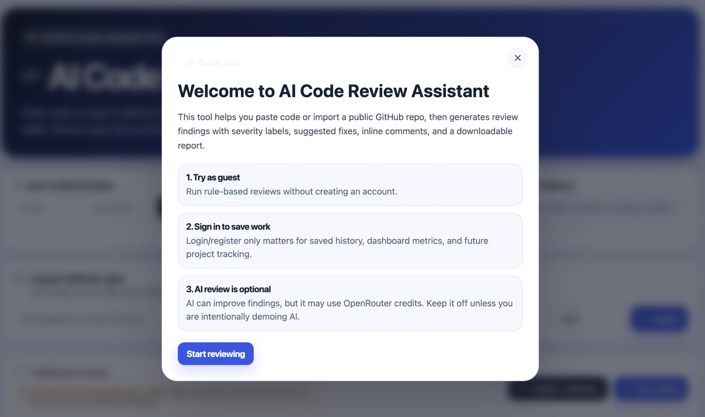
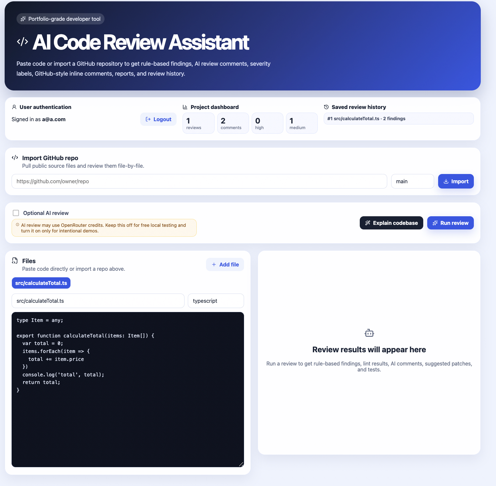
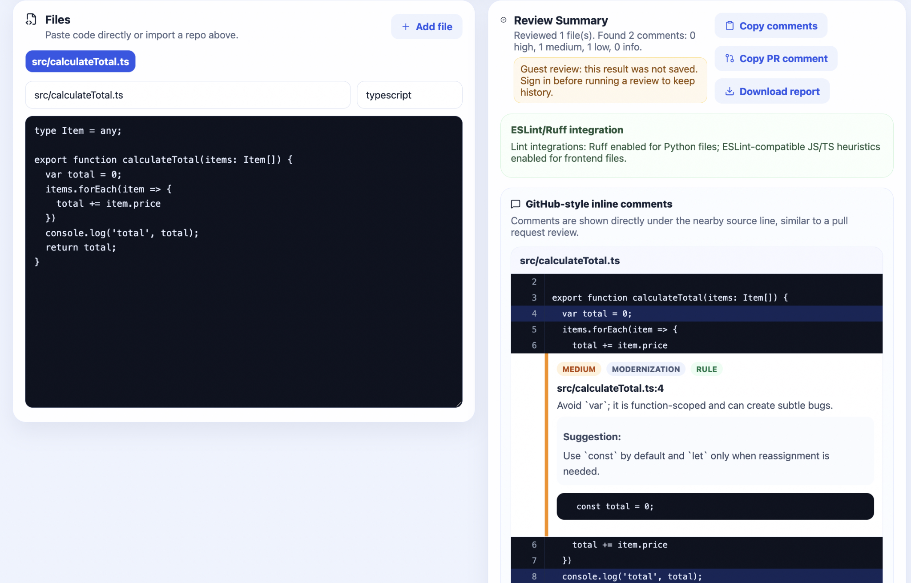
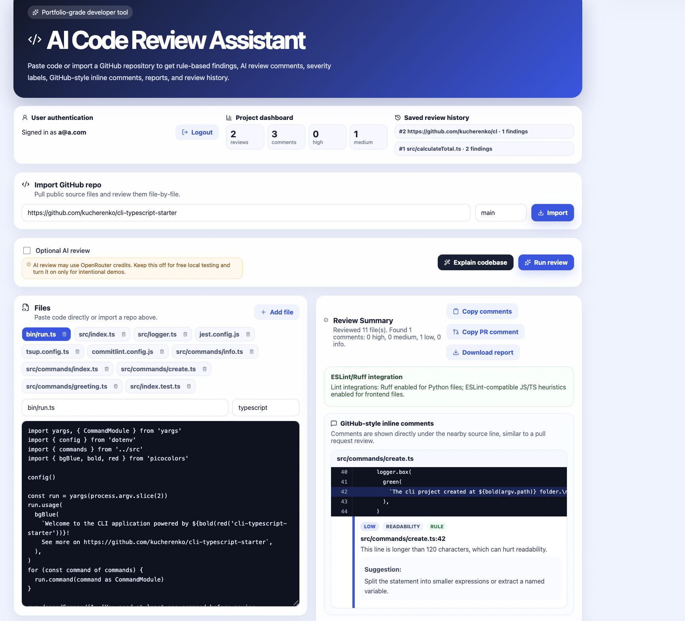

# AI Code Review Assistant

A portfolio-grade full-stack developer tool that imports public GitHub repositories or pasted code, reviews files using a hybrid rule-based + AI approach, and generates GitHub-style inline comments, patch suggestions, unit test ideas, saved history, dashboards, and downloadable reports.

## Live Demo

Frontend: https://ai-code-review-assistant-gold.vercel.app  
Backend API Docs: https://ai-code-review-assistant-e60j.onrender.com/docs

> Note: The backend is hosted on Render's free tier, so the first request after inactivity may take a little longer while the service wakes up.


## Features

- Paste code or import a public GitHub repository
- Review multiple files in one run
- Rule-based review for common maintainability/readability issues
- AI review through OpenRouter
- GitHub-style inline comments under the affected source lines
- Copy PR-style review comments
- Optional GitHub PR comment posting through `GITHUB_TOKEN`
- Better patch diff display
- Downloadable Markdown review report
- User authentication for saved local review history
- Project dashboard with review/finding counts
- Ruff integration for Python files
- ESLint-compatible JavaScript/TypeScript heuristics
- Backend endpoint tests with Pytest
- GitHub Actions CI for backend and frontend
- Deployment guide for Render + Vercel

## Screenshots

### Guest onboarding

The first-time tutorial explains how guest mode, saved history, and optional AI review work.



### Main dashboard

The dashboard supports guest reviews, user authentication, GitHub repository import, optional AI review, and code editing.



### GitHub-style inline review comments

Review findings are shown near the relevant source lines with severity labels, categories, suggestions, and patch snippets.



### Public GitHub repository review

The app can import public GitHub repositories and review multiple files together.



## Tech stack

- Frontend: React, TypeScript, Vite
- Backend: FastAPI, Pydantic
- AI: OpenRouter-compatible LLM API
- Repo import: GitHub API
- Storage: SQLite for MVP review history
- Linting: Ruff + JS/TS lint heuristics
- DevOps: Docker Compose, GitHub Actions

## Run locally

```bash
cp backend/.env.example backend/.env
docker compose up --build
```

Frontend:

```text
http://localhost:5173
```

Backend docs:

```text
http://localhost:8000/docs
```

## Environment variables

Edit `backend/.env`:

```env
OPENROUTER_API_KEY=your_openrouter_key
OPENROUTER_MODEL=openai/gpt-4o-mini
GITHUB_TOKEN=
DATABASE_URL=sqlite:///./review_assistant.db
REDIS_URL=redis://localhost:6379/0
CORS_ORIGINS=http://localhost:5173,http://127.0.0.1:5173
```

`GITHUB_TOKEN` is optional. Without it, the app can still generate PR-style Markdown comments. With it, the backend can post a summary comment to a GitHub PR.

## Workflow

```text
Import GitHub repo → Run review → View GitHub-style inline comments → Copy PR comment or download report
```

## API endpoints

- `POST /api/auth/register`
- `POST /api/auth/login`
- `POST /api/import/github`
- `POST /api/review`
- `POST /api/explain`
- `GET /api/history`
- `GET /api/dashboard`
- `POST /api/report/markdown`
- `POST /api/pr/comment`

## Testing

Backend tests:

```bash
cd backend
pip install -r requirements.txt
pytest
```

Frontend build:

```bash
cd frontend
npm install
npm run build
```

## What makes this portfolio-ready

This is not just a pasted-code toy app. It demonstrates API design, GitHub integration, structured LLM output, local authentication, persistence, linting, downloadable reports, CI, and a production-style UI flow.

## Future improvements

- True GitHub line-level review comments using commit SHA and diff positions
- OAuth-based GitHub sign-in
- Team workspaces
- Persistent PostgreSQL deployment
- Background job queue for large repositories


## Guest mode and AI cost note

The app supports a low-friction guest mode: users can paste code, import public GitHub repositories, run rule-based review, copy comments, and download reports without signing in. Authentication is used for saved review history and dashboard metrics.

AI review is optional and disabled by default in the UI because it can consume OpenRouter credits. For free/local testing, keep AI review off. To intentionally demo AI review, configure `OPENROUTER_API_KEY` in `backend/.env` and toggle AI review on.
